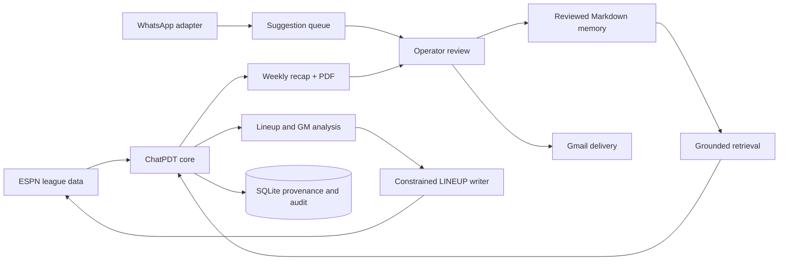

# ChatPDT Fantasy League Agent

ChatPDT is a production-oriented fantasy football agent that combines ESPN league data, reviewed Markdown memory, weekly editorial generation, approval-gated publishing, and narrowly scoped roster automation.

This repository is a **sanitized portfolio edition**. It contains fictional league data and test credentials. The production knowledge base, member identities, photographs, email addresses, ESPN session values, and delivery records are excluded.

## What it does

- Pulls matchups, standings, rosters, projections, and available players from ESPN.
- Generates an HTML and PDF weekly recap grounded in final scores and reviewed Markdown memory.
- Keeps one profile per member plus league history, rules, precedents, editorial boundaries, and a ledger of previously used stories and jokes.
- Sends a private draft to the operator for editing and exact-content approval before league delivery.
- Accepts natural-language memory suggestions while keeping conversations separate from canonical memory.
- Produces free-agent and two-sided trade analysis without submitting acquisitions or offers.
- Automatically improves the managed starting lineup through a constrained ESPN write boundary.
- Keeps durable provenance, approval, audit, and delivery records.

## Safe ESPN write access

ChatPDT can make one class of autonomous ESPN change: moving an eligible player between the starting lineup and bench. The write path:

1. Reads the authenticated roster and current lock state.
2. Computes the highest-projected legal assignment.
3. Requires a configurable minimum projected gain.
4. Refreshes the roster immediately before writing and rejects stale plans.
5. Sends only ESPN `LINEUP` transaction items.
6. Reads the roster again and verifies every changed slot.
7. Records the result and can notify the operator by email.

It cannot automatically add, drop, claim, bid on, trade, or move a player into or out of IR.

| Capability | Authority |
|---|---|
| Starter/bench adjustment | Automatic when enabled and verified |
| Free-agent and waiver recommendations | Advisory |
| Add, drop, claim, or bid | Operator approval required; no writer implemented |
| Trade recommendations | Advisory and scored for both teams |
| Submit a trade offer | Operator approval required; no writer implemented |
| Canonical memory changes | Exact operator approval required |
| League newsletter delivery | Exact operator approval required |

The write implementation is in [`src/espn-lineup.js`](src/espn-lineup.js), with mocked transaction and verification coverage in [`tests/espn-lineup.test.js`](tests/espn-lineup.test.js).

## Architecture



Channel adapters isolate Gmail and WhatsApp from the core workflow. The WhatsApp Web adapter can later be replaced with an official provider without changing memory or publication approvals.

## Run the sanitized demo

Requires Node.js 24 or newer.

```powershell
npm ci
node scripts/setup.js
npm test
npm run eval
npm run demo
npm start
```

Open `http://127.0.0.1:8787`. The demo uses local output only and does not contact ESPN, Gmail, or WhatsApp.

Copy `.env.example` to `.env` only for local development. Never commit session cookies, email credentials, tokens, member data, photographs, or runtime databases.

## Engineering highlights

- **Fail-closed automation:** incomplete scores, stale rosters, changed approvals, and ambiguous deliveries stop the workflow.
- **Exact-content approval:** edits invalidate approval; PDF and destination hashes are checked again at publication.
- **Conversation/memory separation:** chat and pending suggestions are never retrieval authority.
- **Idempotent operations:** weekly jobs and delivery attempts use durable keys to reduce duplicate sends.
- **Two-sided trades:** a proposed one-for-one trade must improve both projected starting lineups over the rest of the season.
- **Replaceable integrations:** channel interfaces keep provider-specific behavior outside the agent core.

See [the architecture notes](docs/architecture.md) and [security policy](SECURITY.md) for the main trust boundaries.

## Scope

This is an independent portfolio project and is not affiliated with or endorsed by ESPN, WhatsApp, Meta, Gmail, or any university or fraternity. ESPN and WhatsApp Web integrations rely on unofficial interfaces and may change.

## License

[MIT](LICENSE)


